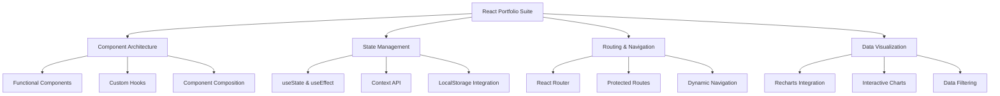

# ⚛️ React Portfolio Suite

<div align="center">


[](https://opensource.org/licenses/MIT)
[](https://github.com/saadoxyz/dev-hub-react/stargazers)
[](https://github.com/saadoxyz/dev-hub-react/network)
[](https://github.com/saadoxyz/dev-hub-react/issues)

**A comprehensive React project containing three complete frontend applications showcasing modern development practices**

[🚀 Live Demo](#) • [📖 Documentation](#-included-tasks) • [🐛 Report Bug](https://github.com/saadoxyz/dev-hub-react/issues) • [✨ Request Feature](https://github.com/saadoxyz/dev-hub-react/issues)

</div>

---

## 🎯 About The Project

<div align="center">
  
</div>

This React project combines **three real-world frontend tasks** into a single unified codebase, offering a complete hands-on demonstration of modern React development. Perfect for developers looking to showcase their skills or learn advanced React concepts.

### ✨ What's Inside

<table>
<tr>
<td align="center" style="border: none;">

<br><strong>Personal Blog</strong>
<br><sub>Responsive blog interface</sub>
</td>
<td align="center" style="border: none;">

<br><strong>Freelance Dashboard</strong>
<br><sub>Multi-page admin panel</sub>
</td>
<td align="center" style="border: none;">

<br><strong>Job Tracker</strong>
<br><sub>Full CRUD application</sub>
</td>
</tr>
</table>

---

## 🚀 Quick Start

<details>
<summary><b>📋 Prerequisites</b></summary>

Before you begin, ensure you have the following installed:
- Node.js (v16.0 or higher)
- npm or yarn package manager
- Git

</details>

### 🛠️ Installation

```bash
# Clone the repository
git clone https://github.com/saadoxyz/dev-hub-react.git

# Navigate to project directory
cd dev-hub-react

# Install dependencies
npm install

# Start development server
npm run dev
```

<div align="center">

**🎉 That's it! Open [http://localhost:5173](http://localhost:5173) to view the project.**

</div>

---

## 🎨 Features Overview

<details>
<summary><b>📝 Personal Blog Homepage</b></summary>

<br>

- ✅ **Responsive Design** - Works on all device sizes
- 🔍 **Search Functionality** - Filter posts by title
- 🏷️ **Category Filters** - Tech, Travel, Food categories
- 🎨 **Card Layout** - Beautiful post cards with images
- 📄 **Pagination** - Navigate through multiple pages
- ⚡ **Fast Loading** - Optimized performance

```javascript
// Example blog post structure
{
  id: 1,
  title: "Getting Started with React",
  category: "Tech",
  date: "2024-01-15",
  image: "/blog-image.jpg",
  excerpt: "Learn the fundamentals of React..."
}
```

</details>

<details>
<summary><b>📊 Freelance Dashboard</b></summary>

<br>

- 🧭 **React Router Navigation** - Seamless page transitions
- 📱 **Responsive Sidebar** - Collapsible mobile menu
- 📈 **Interactive Charts** - Bar & Pie charts with Recharts
- 📋 **Project Management** - Client project tracking
- 👤 **Profile Settings** - Editable user information
- 🔔 **Notifications** - Real-time activity updates

| Page | Features |
|------|----------|
| 🏠 Overview | Stats cards, activity feed, charts |
| 📁 Projects | Data table, search, filtering |
| ⚙️ Settings | Profile form, preferences |

</details>

<details>
<summary><b>💼 Job Application Tracker</b></summary>

<br>

- 🔄 **Full CRUD Operations** - Create, Read, Update, Delete
- 🌐 **Context API** - Global state management
- 💾 **LocalStorage** - Data persistence
- 📤 **Import/Export** - JSON data handling
- 📱 **Mobile Responsive** - Works on all devices
- 🎯 **Status Tracking** - Applied, Interview, Rejected, Offer

```javascript
// Job application data structure
{
  id: "uuid",
  company: "Tech Corp",
  position: "Frontend Developer",
  status: "Interview",
  appliedDate: "2024-01-15",
  notes: "Completed technical assessment"
}
```

</details>

---

## 🏗️ Project Structure

```
📦 dev-hub-react/
├── 📁 public/
│   ├── 🖼️ favicon.ico
│   └── 📄 index.html
├── 📁 src/
│   ├── 📄 App.jsx                 # Main router & navigation
│   ├── 📄 Blog.jsx               # Personal blog homepage
│   ├── 📄 Freelance.jsx          # Freelance dashboard
│   ├── 📄 JobTrackerApp.jsx      # Job application tracker
│   ├── 📁 components/            # Reusable components
│   │   ├── 📄 Header.jsx
│   │   ├── 📄 Sidebar.jsx
│   │   └── 📄 Footer.jsx
│   ├── 📁 context/               # Context providers
│   │   └── 📄 JobContext.jsx
│   ├── 📁 data/                  # Mock data & constants
│   │   ├── 📄 blogPosts.js
│   │   ├── 📄 projects.js
│   │   └── 📄 activities.js
│   ├── 📁 utils/                 # Helper functions
│   │   └── 📄 storage.js
│   └── 📄 main.jsx
├── 📄 package.json
├── 📄 vite.config.js
├── 📄 tailwind.config.js
└── 📄 README.md
```

---

## 🛠️ Built With

<div align="center">

| Technology | Purpose | Version |
|------------|---------|---------|
|  | UI Framework | ^18.0.0 |
|  | Navigation | ^6.0.0 |
|  | Styling | ^3.0.0 |
|  | Charts | ^2.5.0 |
|  | Build Tool | ^4.0.0 |

</div>

---

## 📸 Screenshots

<div align="center">

### 📝 Personal Blog


### 📊 Freelance Dashboard


### 💼 Job Tracker


</div>

---

## 🎯 Learning Objectives

<div align="center">



</div>

---

## 🤝 Contributing

<div align="center">

Contributions are what make the open source community such an amazing place to learn, inspire, and create. Any contributions you make are **greatly appreciated**.

</div>

<details>
<summary><b>🔧 Development Setup</b></summary>

1. Fork the Project
2. Create your Feature Branch (`git checkout -b feature/AmazingFeature`)
3. Commit your Changes (`git commit -m 'Add some AmazingFeature'`)
4. Push to the Branch (`git push origin feature/AmazingFeature`)
5. Open a Pull Request

</details>

### 📝 Code Style

- Use ESLint and Prettier for code formatting
- Follow React best practices and hooks guidelines
- Write meaningful commit messages
- Add comments for complex logic

---

## 📊 Project Stats

<div align="center">


</div>

---

## 📞 Contact & Support

<div align="center">

**Saad Khan** - Full Stack Developer

[](mailto:saadok652004@gmail.com)
[](https://github.com/saadoxyz)
[](https://linkedin.com/in/saadoxyz)

**Project Link:** [https://github.com/saadoxyz/dev-hub-react](https://github.com/saadoxyz/dev-hub-react)

</div>

---

## 🙏 Acknowledgments

<div align="center">

- [React Documentation](https://reactjs.org/) for excellent guides
- [Tailwind CSS](https://tailwindcss.com/) for utility-first CSS framework
- [Recharts](https://recharts.org/) for beautiful React charts
- [Shields.io](https://shields.io/) for awesome badges
- [Choose an Open Source License](https://choosealicense.com) for license guidance

</div>

---

<div align="center">

### ⭐ Star this repository if it helped you!

[](https://github.com/saadoxyz)
[](https://reactjs.org/)

**Don't forget to give this project a star! ⭐**

</div>
